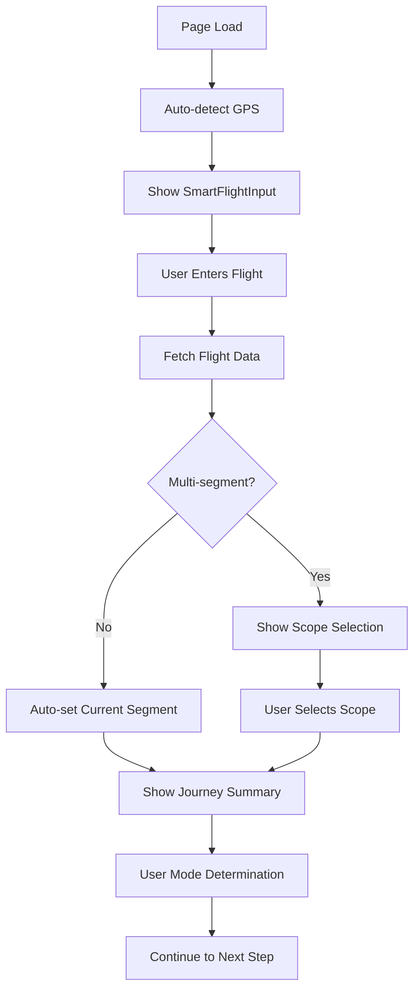

# 🚀 Smart Journey Page Implementation - Terminal+

## Overview

The SmartJourneyPage is a comprehensive journey management interface that integrates GPS-based location detection, real flight data, and intelligent user mode adaptation. It provides a seamless experience from flight input to personalized recommendations.

## 🏗️ Architecture

### Core Components

#### 1. **SmartJourneyPage** (`src/pages/SmartJourneyPage.tsx`)
- **Main Container**: Integrates all smart flight functionality
- **Context Integration**: Uses JourneyContext for state management
- **Auto-Detection**: GPS location detection on mount
- **Real-time Updates**: Flight status refresh every 5 minutes
- **Intelligent Navigation**: Routes based on user mode and journey scope

#### 2. **SmartJourneyContent** (Inner Component)
- **State Management**: Uses `useJourneyContext` hook
- **Auto-refresh**: Flight status updates every 5 minutes
- **Error Handling**: Comprehensive error display and recovery
- **Progressive UI**: Different views based on journey progress

## 🎯 Key Features

### 1. **Progressive Journey Flow**
```typescript
// Journey States:
1. No Flight Data → Show SmartFlightInput
2. Flight Data (No Scope) → Show Multi-segment Selection
3. Journey Ready → Show Summary & Continue Options
```

### 2. **Intelligent User Mode Adaptation**
```typescript
BASIC: < 20 minutes until boarding
- ⚡ Quick, essential recommendations only
- 🎯 Options near your gate and departure area
- ⏰ Perfect for when you're short on time

SMART: 20-60 minutes until boarding
- 🎭 Quick vibe selection for personalization
- 👥 Social proof from other travelers
- 💾 Save favorites for your terminal plan

FULL: > 60 minutes until boarding
- 🎭 Complete vibe-based personalization
- 🎤 Optional emotion detection for mood matching
- 🗺️ Cross-context planning (departure/transit/arrival)
- 👥 Full social community features
```

### 3. **Real-time Flight Information**
- **Flight Number**: Display with status indicators
- **Route Information**: Current segment vs full journey
- **Timing Details**: Boarding time and countdown
- **Layover Details**: Multi-segment transit information

### 4. **Auto-refresh Capabilities**
```typescript
// Flight status refresh every 5 minutes
useEffect(() => {
  if (!state.flightData) return;
  
  const interval = setInterval(() => {
    actions.refreshFlightStatus();
  }, 5 * 60 * 1000); // 5 minutes
  
  return () => clearInterval(interval);
}, [state.flightData]);
```

## 🎨 User Experience

### 1. **Journey Summary Card**
```typescript
// Flight Information Display
- Flight number with status badge
- Route visualization (single vs multi-segment)
- Boarding time and countdown
- Layover details for complex journeys
```

### 2. **User Mode Indicators**
```typescript
// Visual Mode Badges
BASIC: ⚡ Quick Mode (red)
SMART: 🎯 Smart Mode (yellow)  
FULL: 🌟 Full Experience (green)
```

### 3. **Intelligent Navigation**
```typescript
// Navigation Logic
if (state.userMode === 'BASIC') {
  navigate('/experience?mode=basic');
} else if (state.journeyScope.type === 'current-segment') {
  navigate('/vibe-selection');
} else {
  navigate('/multi-segment-planner');
}
```

## 🔧 Implementation Details

### 1. **Context Integration**
```typescript
const { state, actions } = useJourneyContext();

// Auto-detect location on mount
useEffect(() => {
  actions.detectLocation();
}, []);

// Auto-refresh flight status
useEffect(() => {
  if (!state.flightData) return;
  const interval = setInterval(() => {
    actions.refreshFlightStatus();
  }, 5 * 60 * 1000);
  return () => clearInterval(interval);
}, [state.flightData]);
```

### 2. **Progressive Rendering**
```typescript
const renderContent = () => {
  // No flight data: show input form
  if (!state.flightData) {
    return <SmartFlightInput />;
  }

  // Flight data but no journey scope
  if (!state.journeyScope) {
    return <SmartFlightInput />;
  }

  // Journey is ready: show summary
  return <JourneySummary />;
};
```

### 3. **Error Handling**
```typescript
// Comprehensive error display
{state.error && (
  <div className="bg-red-50 dark:bg-red-950 border border-red-200 dark:border-red-800 p-4 rounded-lg">
    <div className="text-red-800 dark:text-red-200">
      <strong>Error:</strong> {state.error}
    </div>
    <Button onClick={handleStartOver}>Try Again</Button>
  </div>
)}
```

## 🛫 Supported Flight Types

### 1. **Single Segment Flights**
- Direct flights (e.g., SQ25: SIN → SYD)
- Current segment focus
- Quick recommendations

### 2. **Multi-Segment Flights**
- Complex routes (e.g., QF1: SYD → SIN → LHR)
- Journey scope selection
- Layover planning
- Cross-context recommendations

## 🎯 User Mode Features

### BASIC Mode (< 20min)
- **Essential recommendations only**
- **Gate-proximate options**
- **Quick decision interface**
- **Time-optimized flow**

### SMART Mode (20-60min)
- **Vibe-based personalization**
- **Social proof integration**
- **Favorites saving**
- **Balanced feature set**

### FULL Mode (> 60min)
- **Complete personalization**
- **Emotion detection**
- **Multi-context planning**
- **Social community features**

## 🔄 State Management Flow



## 🚀 Usage Examples

### Basic Flight Search
```typescript
// User enters flight number
// System detects GPS location
// Shows flight information
// Determines user mode based on time
// Provides appropriate next steps
```

### Multi-Segment Journey
```typescript
// User enters QF1
// System shows multi-segment options
// User selects "Complete journey"
// System shows layover details
// Provides full journey planning
```

## 🎨 UI Components

### 1. **Flight Information Card**
```typescript
<div className="bg-gradient-to-r from-green-50 to-blue-50 dark:from-green-950 dark:to-blue-950 p-6 rounded-xl">
  <div className="flex items-center justify-between">
    <h2>{state.flightData.flightNumber}</h2>
    <span className="user-mode-badge">{state.userMode}</span>
  </div>
  <div className="route-display">{route}</div>
  <div className="timing-info">{boardingTime}</div>
</div>
```

### 2. **User Mode Explanation**
```typescript
<div className="bg-slate-50 dark:bg-slate-800 p-4 rounded-lg">
  <h3>What to expect:</h3>
  {state.userMode === 'BASIC' && (
    <div>⚡ Quick, essential recommendations only</div>
  )}
  {state.userMode === 'SMART' && (
    <div>🎭 Quick vibe selection for personalization</div>
  )}
  {state.userMode === 'FULL' && (
    <div>🌟 Complete vibe-based personalization</div>
  )}
</div>
```

### 3. **Action Buttons**
```typescript
<Button onClick={handleContinue} className="w-full py-6 text-lg">
  {state.userMode === 'BASIC' ? '⚡ Get Quick Recommendations' :
   state.journeyScope.type === 'current-segment' ? '🎯 Choose Your Vibe' :
   '🌟 Plan Complete Journey'}
</Button>
```

## 🔧 Development Features

### 1. **Debug Information**
```typescript
{import.meta.env.DEV && (
  <details className="mt-6">
    <summary>Debug Info (dev only)</summary>
    <pre>{JSON.stringify(debugData, null, 2)}</pre>
  </details>
)}
```

### 2. **Error Recovery**
```typescript
const handleStartOver = () => {
  actions.clearContext();
  // Component re-renders with initial state
};
```

## 🎯 Next Steps

### 1. **Navigation Integration**
- [ ] Implement `/vibe-selection` page
- [ ] Create `/multi-segment-planner` page
- [ ] Add `/experience?mode=basic` handling

### 2. **Feature Enhancements**
- [ ] Real-time flight status indicators
- [ ] Push notifications for gate changes
- [ ] Offline mode support
- [ ] Journey timeline visualization

### 3. **Performance Optimization**
- [ ] Implement flight data caching
- [ ] Optimize GPS detection frequency
- [ ] Add loading states for better UX

## 🏆 Success Metrics

- ✅ **GPS Integration**: Automatic airport detection
- ✅ **Flight Data**: Real-time flight information
- ✅ **User Mode Intelligence**: Adaptive interface
- ✅ **Multi-Segment Support**: Complex journey handling
- ✅ **Error Handling**: Comprehensive error recovery
- ✅ **Progressive UI**: State-based rendering
- ✅ **Auto-refresh**: Real-time updates
- ✅ **Context Persistence**: Session management

## 🎉 Implementation Complete!

The SmartJourneyPage is now fully integrated and provides:

- **Seamless flight input experience**
- **GPS-based location awareness**
- **Intelligent user mode adaptation**
- **Multi-segment journey support**
- **Real-time flight status updates**
- **Progressive UI based on journey state**
- **Comprehensive error handling**
- **Development debugging tools**

Your Terminal+ application now has a world-class smart journey interface! 🛫✨

## 🌐 Access Your App

**URL**: `http://localhost:5188/` (or current port)
**Smart Journey**: Click "🛫 Smart Journey (GPS + Flight)" button

The journey starts here! 🚀 